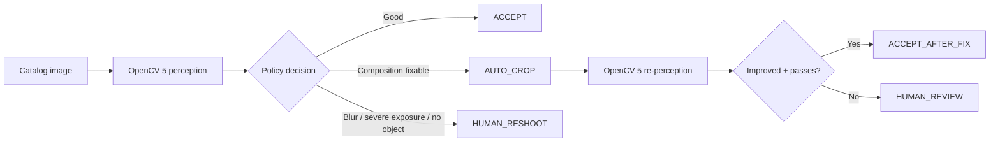

# ListingLens Agent — perception → decision → action

Every step is emitted into the JSON trace. The agent does not call a crop merely because a user asked for one: the OpenCV metrics are the trigger. After an automated correction, OpenCV runs again and the second measurement determines whether the image is accepted.

## Current OpenCV 5 signals

- Laplacian variance for sharpness.
- Mean luminance.
- Shadow and highlight clipping fractions.
- Border variance for simple-background quality.
- Foreground bounding box.
- Object occupancy.
- Object-center offset.

## Human control

The agent only performs a bounded crop automatically. Blur, severe exposure failure, missing foreground, uncertain background, oversized framing, or unsuccessful correction escalate to a human rather than fabricating a fix.
